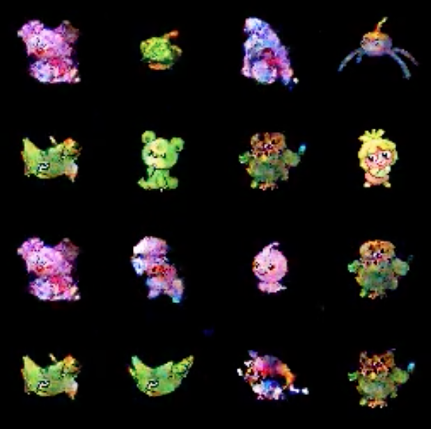

# PokeGAN
This project is an exploration in generating an infinite number of pokemon sprites. This was done by scraping images from the games and then training a GAN to generate new Pokemon. In theory, this could be done with other art assets like floors and walls, using a conditional GAN. 

This simply GAN ended up working, but I believe it is a bit overfit since one can see pokemon that already exist in the final output.

A video of the training process can be found at rthe link below. Each second is 24 frames, and each frame is from 1/10 training epochs. The resulting footage is relatively smooth but can be a bit flashy:
https://www.youtube.com/watch?v=ClJe2RUw26A

<iframe  title="YouTube video player" width="480" height="390" src="https://www.youtube.com/watch?v=ClJe2RUw26A" frameborder="0" allowfullscreen></iframe>

## Linux/Mac Environment Setup ##
- Get virtualenv with: <code>pip3 install virtualenv</code> This should add virtualenv to the system. 
- To create a virtual env, now use <code>python3 -m venv env_name</code> this will create a virtual env in a folder by that name
- Activate the env by using <code>source env_name/bin/activate</code> 
- To use a requirements file type <code>pip install -r step1/requirements.txt</code> 

## How To Use ##
- Run the pokemon scraper to get sprites 
- Run PokeGAN.py! 
- Create a video of the output with functions in ProjectUtils.py

## Why Pokemon? ##
I figured that for a first foray into GANs, I should keep the images relatively small, and similar to each other. The pokemon games seemed to be a good fit. If anyone has any other suggestions, I'd love to hear them! 

